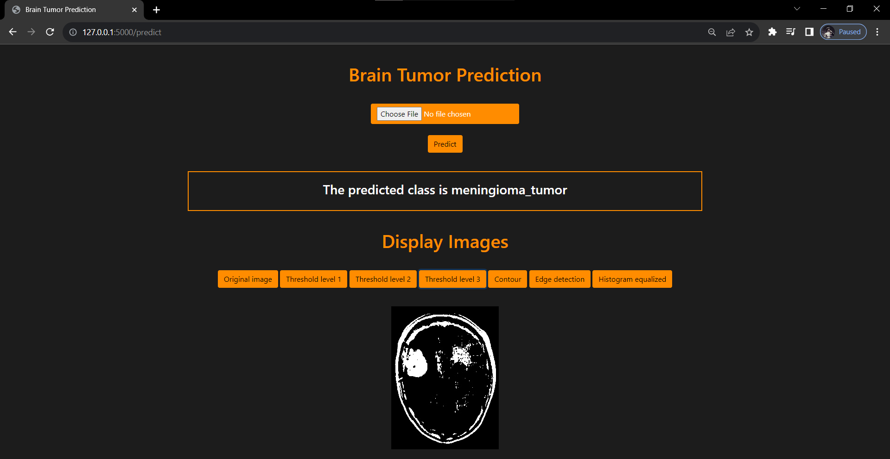

# Brain Tumor Classification and Image Filtering

## Overview
The Brain Tumor Classification and Image Filtering project is a web-based application built with Flask that provides functionality for classifying brain tumor images and performing various image filtering operations. This project includes the classification of brain tumor types using a machine learning model and the application of image filters to enhance and analyze medical images.

## Sample outputs

## Features
- Classifies brain tumor images into categories such as "no tumor," "pituitary tumor," "meningioma tumor," and "glioma tumor."
- Performs image preprocessing, including resizing and normalizing image data.
- Applies image filtering techniques like thresholding, contour detection, edge detection, and histogram equalization.
- Visualizes filtered images for analysis and medical diagnosis.

## Usage
1. Upload a brain tumor image to the web application.
2. The application will classify the uploaded image into one of the tumor categories.
3. It will also apply various image filtering techniques to the uploaded image and save the filtered images for analysis.

## Models and Preprocessing
- The project uses a trained machine learning model for brain tumor classification.
- Principal Component Analysis (PCA) is used for image preprocessing and feature reduction.

## Filters
The following image filters are applied to the uploaded images:
- Thresholding: 1-level, 2-level, and 3-level thresholding.
- Contour Detection: Detection of object contours in images.
- Edge Detection: Detecting edges in the images using Canny edge detection.
- Histogram Equalization: Enhancing image contrast and brightness.
